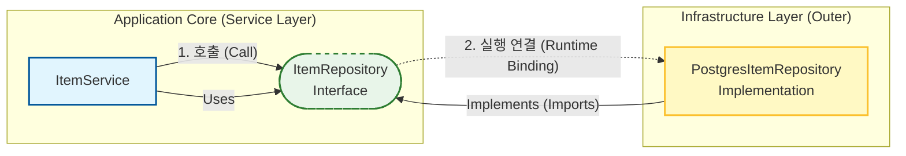

# 클린 아키텍처: 의존성 역전과 레이어의 이해

이 문서는 FastAPI 프로젝트 구조를 통해 **클린 아키텍처의 핵심인 '레이어 분리'와 '의존성 방향'**을 명확히 이해하기 위해 작성되었습니다.

---

## 0. 클린 아키텍처 기본 레이어 구조

클린 아키텍처는 양파처럼 여러 겹의 레이어로 구성됩니다. 가장 중요한 규칙은 **"모든 의존성은 바깥에서 안쪽으로만 향한다"**는 것입니다.


```mermaid
graph TD
    subgraph "Infrastructure Layer (가장 바깥쪽)"
        Infra[Infrastructure (DB, Frameworks)]
    end

    subgraph "Interface Adapters Layer"
        Adapters[Interface Adapters (API, Presenters)]
    end

    subgraph "Application Layer"
        Service[Use Cases / Services]
    end

    subgraph "Domain Layer (가장 안쪽)"
        Entity[Entities (Domain Models)]
    end

    Infra --> Adapters
    Adapters --> Service
    Service --> Entity
    
    style Infra fill:#ffecb3,stroke:#ff6f00,stroke-width:2px
    style Adapters fill:#dcedc8,stroke:#558b2f,stroke-width:2px
    style Service fill:#b3e5fc,stroke:#0277bd,stroke-width:2px
    style Entity fill:#e1bee7,stroke:#7b1fa2,stroke-width:2px
```

> **참고 이미지**: 아래 이미지는 클린 아키텍처의 원본 개념을 잘 설명해주는 다이어그램입니다.
> 
> 
> *출처: [Wikimedia Commons](https://commons.wikimedia.org/wiki/File:Clean_Architecture.png), licensed under CC BY-SA 4.0*

*   **Infrastructure (DB)**: 데이터베이스, 웹 프레임워크 등 언제든 바뀔 수 있는 도구들입니다.
*   **Interface Adapters (API)**: 외부 요청을 받아 내부 서비스가 이해할 수 있는 형태로 변환합니다.
*   **Use Cases (Service)**: 애플리케이션의 핵심 업무 규칙(비즈니스 로직)을 담당합니다.
*   **Entities (Domain)**: 핵심 업무 개념(비즈니스 객체)을 정의합니다.

---

## 1. 딜레마: "서비스가 DB를 부르는데 왜 DB가 더 바깥쪽인가?"

### 혼란의 시작
우리가 코드를 실행할 때의 흐름(Execution Flow)을 보면, 바깥쪽인 API가 중간의 Service를 부르고, Service가 안쪽의 DB(Infrastructure)를 부르는 것처럼 보입니다.

> **실행 순서 (Control Flow)**:
> `API Controller` → `Service` → `Repository(DB)`

그런데 클린 아키텍처 다이어그램을 보면 **Infrastructure(DB)가 가장 바깥쪽**에 있고, **Service가 안쪽**에 있습니다. 이 괴리감은 **"제어 흐름"과 "의존성 방향"이 반대**이기 때문에 발생합니다. 이것이 바로 **의존성 역전 원칙(DIP)**입니다.

---

## 2. 핵심 원리: 제어 흐름 vs 의존성 흐름

이 구조의 핵심 비밀은 **인터페이스(Interface)**에 있습니다.

### 다이어그램: 실행 흐름 vs 의존성



1.  **제어 흐름 (실행 시점)**: Service가 데이터를 요청하면, 실제로는 Infra(Postgres)가 움직입니다. (왼쪽 → 오른쪽)
2.  **의존성 흐름 (구현 시점)**:
    *   `Service`는 `Infra`를 모릅니다. (`PostgresRepository`를 import 하지 않음)
    *   `Infra`는 `Service`가 정의한 `Interface`를 바라봅니다. (`ItemRepository`를 import 함)
    *   즉, **바깥쪽(Infra)이 안쪽(Service)에 의존**하게 됩니다. (오른쪽 → 왼쪽)

---

## 3. 비유: 주문서(Interface)와 납품업자(Infrastructure)

이 관계를 갑(甲, Service)과 을(乙, Infrastructure)의 비즈니스 관계에 비유하면 이해가 쉽습니다.

### 상황 설정
*   **Service (갑)**: 핵심 비즈니스를 담당하는 본사입니다. "데이터 저장/조회"라는 기능이 필요합니다.
*   **Infrastructure (을)**: 기술을 제공하는 외주 업체(PostgreSQL, MySQL, Redis 등)입니다.

### 의존성 역전의 과정
1.  **일반적인 방식 (나쁜 예)**:
    *   본사(Service)가 외주 업체(Postgres)의 기술 명세서에 맞춰서 업무 매뉴얼을 작성합니다.
    *   *문제점*: 외주 업체를 바꾸면 본사 매뉴얼도 다 뜯어고쳐야 합니다. (본사가 을에게 휘둘림)

2.  **클린 아키텍처 방식 (DIP)**:
    *   본사(Service)가 **"우리는 이런 양식(Interface)으로만 데이터를 받겠습니다"**라고 **주문서(Interface)**를 발행합니다.
    *   외주 업체(Infra)는 이 주문서 양식을 보고, 자기 기술(Postgres)을 이용해서 그 양식에 딱 맞는 결과물을 만들어 바칩니다.
    *   *장점*: 외주 업체를 MySQL로 바꾸더라도, 새 업체가 **똑같은 주문서 양식**만 지키면 본사는 아무런 타격을 입지 않습니다.

> 즉, **"가장 바깥쪽 레이어"**라는 말은 **"언제든지 갈아끼울 수 있는 소모품/부품(Plug-in)"**이라는 뜻입니다. DB는 언제든 교체될 수 잇는 부품이므로 가장 바깥쪽에 위치합니다.

---

## 4. API 파일(`api/v1/items.py`)의 역할

"그럼 `api/v1/items.py`는 왜 Service, Infra, Domain을 다 `import` 하고 있나요? 얘는 왜 이렇게 의존성이 많나요?"

이 파일은 단순한 소스 코드가 아니라 **"조립 공장 (Composition Root)"**이기 때문입니다.

*   **역할**: 본사(Service)와 외주 업체(Infra)를 **연결시켜주는 중개자**입니다.
*   **동작**:
    1.  요청이 들어옴.
    2.  "자, Service야. 이번엔 이 외주 업체(Postgres)를 써서 일해라." (`Depends`를 통한 주입)
    3.  Service는 그게 누군지 모르지만, 그냥 주문서(Interface)대로 일을 시킴.

그래서 이 파일은 **모든 부품을 알아야 조립을 할 수 있기 때문에** 여러 모듈을 `import` 하는 것이 정상이며, 이는 클린 아키텍처를 위반하는 것이 아니라 **지탱하고 있는 것**입니다.
